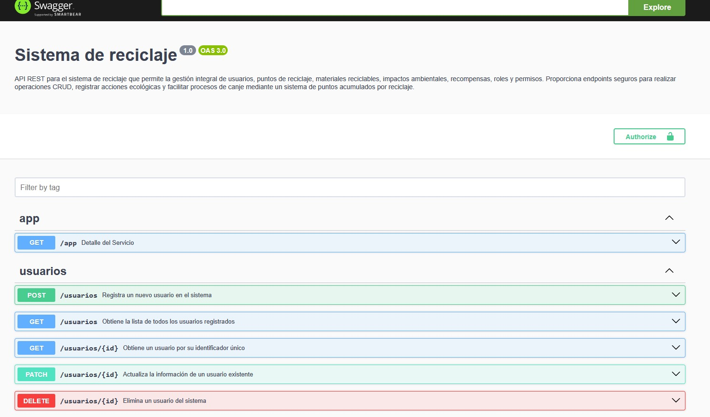
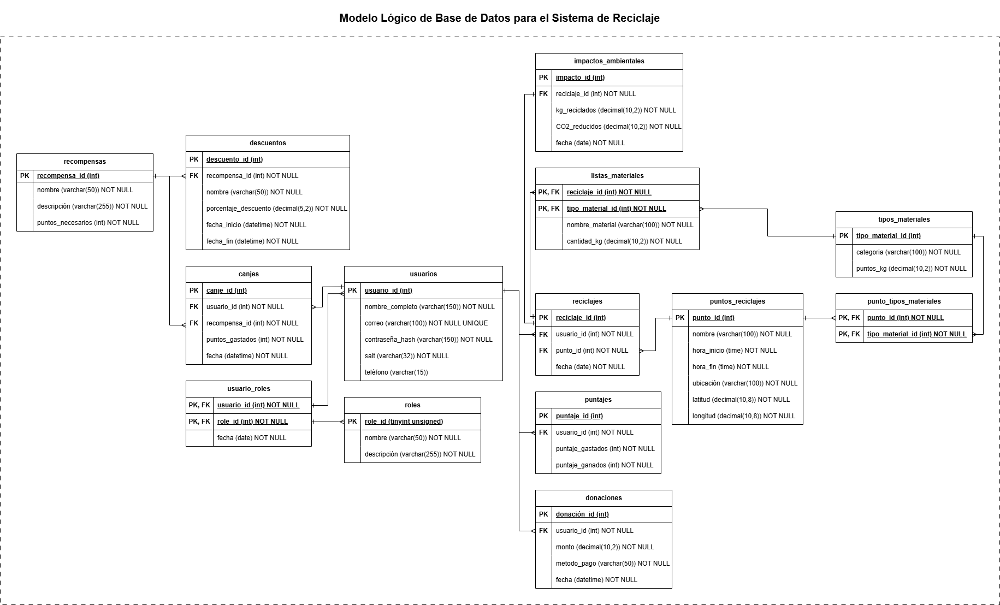
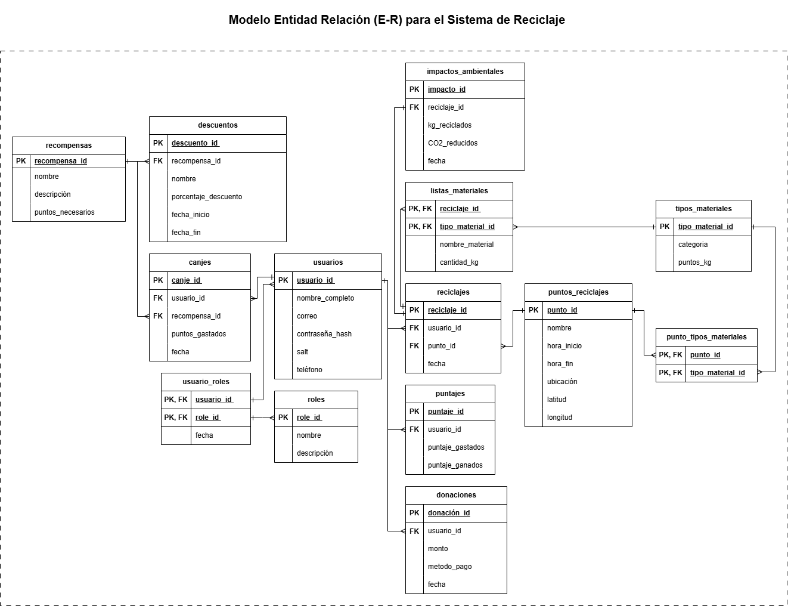
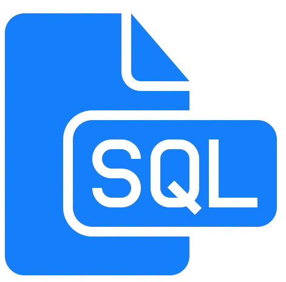

# ♻️🌱 Sistema de Reciclaje API

Una API REST robusta y modular desarrollada con **NestJS** y **TypeORM**, diseñada para gestionar de forma eficiente usuarios, puntos de reciclaje, materiales reciclables, impactos ambientales y recompensas.



### Miembros del Grupo:
  - Vargas Méndez Alejandra
  - Raúl Cesar Conde Rodríguez
  - Romero Gandarillas Alex Fernando
  - Fernandez Lazcano Oscar Rolando

## ✅ Características principales

- Operaciones *CRUD* completas para todas las entidades del sistema

- Borrado lógico con manejo de campos fecha_eliminacion para mantener la integridad de los datos.

- Gestión de recompensas y canjes basada en un sistema de puntos acumulados por reciclaje.

- Seguimiento del impacto ambiental mediante registros de CO₂ reducido y kg reciclados por usuario.

- Sistema de roles y permisos para controlar el acceso y las funciones dentro del sistema.

- Donaciones como método complementario para apoyar iniciativas ecológicas.

- Descuentos y promociones asociados a recompensas específicas.

- Soporte para materiales reciclables categorizados y su asociación por punto de reciclaje.


## 🧱 Tecnologías

- **NestJS** – Framework para Node.js
- **TypeORM** – ORM para TypeScript
- **MySQL** – Base de datos relacional
- **bcrypt** – Encriptación de contraseñas
- **Docker** *(opcional)* – Para contenerización
- **Swagger** – Para documentación de API


## 🛠 Instalación

1. Clonar el repositorio:

```bash
git clone https://github.com/Alejandra786/sistema-de-reciclaje
cd sistema-de-reciclaje
```

2. Instalar dependencias:

```bash
npm install
```

3. Crear .env con tu configuración de MySQL:

```bash
DB_TYPE=mysql
DB_HOST=hopper.proxy.rlwy.net
DB_PORT=47421
DB_USER=root
DB_PASS=iwFQGoZuoOWKIMzIjhSxPAUhHeBNSOgg
DB_NAME=sistema_reciclaje
```

4. Crear la base de datos y las tablas si es necesario:

```bash
npm run init:db

Si se te solicita, ingresa la contraseña correspondiente: iwFQGoZuoOWKIMzIjhSxPAUhHeBNSOgg
```

5. Ejecutar el servidor:

```bash
npm run start:dev
```

## 🗂 Diagramas y documentación de base de datos

Para facilitar la comprensión del diseño de la base de datos y sus relaciones, se han incluido diagramas en la carpeta local [docs/diagramas_db](./docs/diagramas_db). También puedes visualizarlos en mayor detalle accediendo al siguiente enlace: [Ver diagramas](https://drive.google.com/file/d/1RSbK_8Dj5eRUlT4VAHxuvG-1l8HKYbQV/view?usp=sharing).


Los diagramas disponibles incluyen:

### Modelo Lógico


### Modelo Entidad-Relación


### Script de creación de tablas


[Ver script de creación de tablas](./docs/diagramas_db/script_db.sql)

Estos archivos permite entender la estructura general, muestra cómo se relacionan las entidades del sistema, indicando claves primarias y foráneas, tipos de datos, restricciones y las relaciones uno a uno, uno a muchos y muchos a muchos.